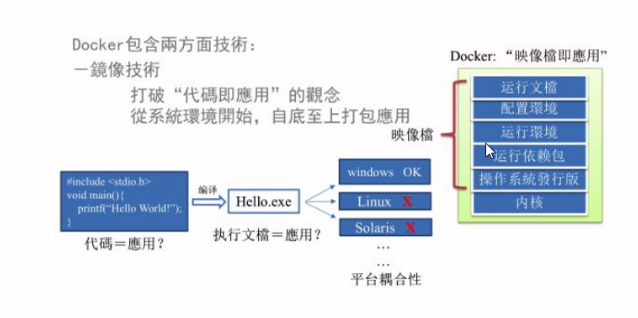

# Docker基础核心技术笔记（立足于javaee）
  为什么学习？  自己正在奋力学习大数据，而大数据太多框架需要安装，所以为避免不必要的麻烦，学习一下Docker。

## 为什么会有Docker的出现？
由于开发+运维之间的协作出现的配置和环境问题。

## 解决方案：
开发端将代码、配置、系统、数据...全部打包。  
运维端利用Docker直接"复印"一份完全一样的
## Docker原理图

之前在服务器配置一个应用的运行环境，要安装各种软件，Java/Tomcat/MySQL/JDBC驱动包等 。
  安装和配置这些东西有多麻烦就不说了，它还不能跨平台。假如我们是在Windows上安装的这
    些环境，到了Linux又得重新装。况且就算不跨操作系统，换另一台同样操作系统的服务器，
      要移植应用也是非常麻烦的。  I

 传统上认为，软件编码开发/测试结束后，所产出的成果即是程序或是能够编译执行的二进制字
   节码等(java为例)。而为了让这些程序可以顺利执行，开发团队也得准备完整的部署文件，让
   维运团队得以部署应用程式，开发需要清楚的告诉运维部署团队，用的全部配置文件+所有软件
   环境。不过，即便如此，仍然常常发生部署失败的状况。Docker镜 像的设计，使得Docker得以
   打破过去「程序即应用」的观念。透过镜像(images)将作业系统核心除外，运作应用程式所需
   要的系统环境，由下而上打包，达到应用程式跨平台间的无缝接轨运作。

## Docker理念
Docker是基于Go语言实现的云开源项目。  
Docker的主要目标是“Build, Ship and Run Any App,Anywhere"，也就是通过对应用组件的封装、分发、部署、运行等生命周期的管理，使用户的APP (可以是一个WEB应用或数据库应用等等)及其运行环境能够做到“一次封装，到处运行”。    
 
Linux容器技术的出现就解决了这样-一个问题，而Docker就是在它的基础上发展过来的。将应用运行在Docker容器上面，而Docker容器在任何操作系统上都是一致的，这就实现了跨平台、跨服务器。只需要一次配置好环境，换到别的机子上就可以一-键部署好，大大简化了操作。

