# Docker基础核心技术笔记（立足于javaee）
  为什么学习？  自己正在奋力学习大数据，而大数据太多框架需要安装，所以为避免不必要的麻烦，学习一下Docker。
# 第一部分
## 1.1、为什么会有Docker的出现？
由于开发+运维之间的协作出现的配置和环境问题。

## 1.2、解决方案：
开发端将代码、配置、系统、数据...全部打包。  
运维端利用Docker直接"复印"一份完全一样的
## 1.3、Docker原理图


之前在服务器配置一个应用的运行环境，要安装各种软件，Java/Tomcat/MySQL/JDBC驱动包等 。
  安装和配置这些东西有多麻烦就不说了，它还不能跨平台。假如我们是在Windows上安装的这
    些环境，到了Linux又得重新装。况且就算不跨操作系统，换另一台同样操作系统的服务器，
      要移植应用也是非常麻烦的。  I

 传统上认为，软件编码开发/测试结束后，所产出的成果即是程序或是能够编译执行的二进制字
   节码等(java为例)。而为了让这些程序可以顺利执行，开发团队也得准备完整的部署文件，让
   维运团队得以部署应用程式，开发需要清楚的告诉运维部署团队，用的全部配置文件+所有软件
   环境。不过，即便如此，仍然常常发生部署失败的状况。Docker镜 像的设计，使得Docker得以
   打破过去「程序即应用」的观念。透过镜像(images)将作业系统核心除外，运作应用程式所需
   要的系统环境，由下而上打包，达到应用程式跨平台间的无缝接轨运作。

## 1.4、Docker理念
Docker是基于Go语言实现的云开源项目。  
Docker的主要目标是“Build, Ship and Run Any App,Anywhere"，也就是通过对应用组件的封装、分发、部署、运行等生命周期的管理，使用户的APP (可以是一个WEB应用或数据库应用等等)及其运行环境能够做到“一次封装，到处运行”。    
   
Linux容器技术的出现就解决了这样-一个问题，而Docker就是在它的基础上发展过来的。将应用运行在Docker容器上面，而Docker容器在任何操作系统上都是一致的，这就实现了跨平台、跨服务器。只需要一次配置好环境，换到别的机子上就可以一-键部署好，大大简化了操作。

## 1.5、Docker是什么？
解决了运行环境和配置问题软件容器，方便做持续集成并有助于整体发布的容器虚拟化技术。

## 1.6、Docker能干什么？
### 1.6.1、之前的虚拟机技术
虚拟机(virtual machine)就是带环境安装的一种解决方案。  
它可以在种操作系统里面运行另一种操作系统，比如在Windows系统里面运行Linux 系统。应用程序对此毫无感知，因为虚拟机看上去跟真实系统一模-样，而对于底层系统来说，虚拟机就是一个普通文件，不需要了就删掉，对其他部分毫无影响。这类虚拟机完美的运行了另一套系统，能够使应用程序，操作系统和硬件三者之间的逻辑不变。  


### 1.6.2、虚拟机的缺点
1.资源占用多 2.冗余步骤多 3.启动慢  

### 1.6.3、容器虚拟化技术
由于前面虚拟机存在这些缺点，Linux 发展出了另一种虚拟化技术: Linux 容器(Linux Containers,缩写为LXC)。  
Linux容器不是模拟一个完整的操作系统，而是对进程进行隔离。有了容器，就可以将软件运行所需的所有资源打包到一个隔离的容器中。容器与虚拟机不同，不需要捆绑一整套操作系统，只需要软件工作所需的库资源和设置。系统因此而变得高效轻量并保证部署在任何环境中的软件都能始终如一地运行。  


比较了Docker和传统虚拟化方式的不同之处：  
* 传统虚拟机技术是虚拟出一套硬件后，在其上运行一个完整的操作系统，在该系统上再运行所需应用进程。  
* 而容器内的应用进程直接运行于宿主内核，容器内没有自己的内核，而且也没有进行硬件模拟。因此容器要比传统虚拟机更为轻便。  
* 每个进程之间相互隔离，每个容器有自己的文件系统，容器之间进程不会相互影响，能区分计算资源。这样耦合度进行低。  


### 1.6.4、开发/运维
一次构建，随处运维。  
1.更快速的应用交付和部署。  
2.更便捷的升级和扩缩容。  
3.更简单的系统运维。  
4.更高效的计算资源利用。  

### 1.6.5、企业
1.新浪 2.美团 3.....

## 第二部分
### 2.1、Docker的安装
### 前提说明：
Centos Docker安装
Docker支持一下的Centos版本：
Centos 7（64-bit）
Centos 6.5（64-bit）或者更高版本

### 前提条件
目前，CentOS仅发行版中的内核支持Docker。
Docker运行在CentOS 7上，要求系统为64位、系统内核版本为3.10以上。
Docker运行在CentOS-6.5或更高的版本的CentOS上，要求系统为64位、系统内核版本为2.6.32-431或者更高版本。

I
### 2.1、查看自己的内核
uname命令用于打印当前系统相关信息(内核版本号、硬件架构、主机名称和操作系统类型等)。


### 2.2、查看已安装的CentOS版本信息


## 第三部分-Docker的基本组成
### 3.1、Docker架构图

### 3.2、镜像
镜像/容器
```
Person p1=new Person();
Person p2=new Person();
Person p3=new Person();
```
Docker镜像（Image）就是一个只读的模板。镜像可以用来创建Docker容器，一个镜像可以创建很多容器。

### 3.3、容器
Docker利用容器（Container）独立运行的一个或一组应用。容器是镜像创建的运行实例。
它可以被启动、开始、停止、删除。每个容器都是相互隔离的、保证安全的平台。
可以把容器看做是一一个简易版的Linux环境(包括root用户权限、进程空间、用户空间和网络空间等)和运行在其中的应用程序。
容器的定义和镜像几乎一模一样，也是一堆层的统一视角， 唯一区别在于容器的最上面那一层是可读可写的。


### 3.4、仓库
仓库：每个仓库存放某一类镜像。

### 3.5、小总结


## 第四部分-Docker指令
### 4.1、docker 常用命令如下
#### 管理命令：
```
  container   管理容器
  image       管理镜像
  network     管理网络
  node        管理Swarm节点
  plugin      管理插件
  secret      管理Docker secrets
  service     管理服务
  stack       管理Docker stacks
  swarm       管理Swarm集群
  system      查看系统信息
  volume      管理卷
  
  如：docker container ls 显示所有容器
  ```
#### 普通命令：
```
    
  attach     进入一个运行的容器
  build      从一个DockerFile构建镜像
  commit     从容器创建一个镜像
  cp          从容器和主机文件系统之间拷贝文件 
  create      创建一个容器
  diff        检查容器文件系统上的更改
  events      从服务器获取实时事件
  exec        在正在运行的容器中运行命令
  export      将容器的文件系统导出为tar存档
  history     显示镜像的历史记录
  images      查看镜像列表
  import      从归档文件中创建镜像
  info        显示系统范围的信息
  inspect     返回Docker对象的低级信息
  kill        kill运行中的容器
  load        从存档或者STDIN加载镜像
  login       登陆docker镜像仓库
  logout      退出docker镜像仓库
  logs        获取一个容器的日志
  pause       暂停一个或多个容器中的所有进程
  port        查看端口映射或容器的特定映射列表
  ps          查看容器列表
  pull        从镜像仓库拉取镜像
  push        将本地的镜像上传到镜像仓库,要先登陆到镜像仓库
  rename      重命名容器
  restart     重启容器
  rm          删除容器
  rmi         删除镜像
  run         创建一个新的容器并运行一个命令
  save        将指定镜像保存成 tar 归档文件
  search      从Docker Hub搜索镜像
  start       启动容器
  stats       实时显示容器资源使用情况的统计信息
  stop       停止容器
  tag         标记本地镜像，将其归入某一仓库
  top         展示一个容器中运行的进程
  unpause     恢复容器中所有的进程
  update      更新容器配置
  version    显示Docker的版本信息
  wait        阻塞直到容器停止，然后打印退出代码
  
  如：docker images 显示所有镜像

```
### 4.1、下面将分别介绍一些常用操作
#### docker 拉取并运行一个镜像
1、下载镜像
`
$ docker pull centos
`  

2、查看已经下载的镜像
```
$ docker images
    REPOSITORY          TAG                 IMAGE ID            CREATED             SIZE
    centos              latest              49f7960eb7e4        6 weeks ago         200MB
    hello-world         latest              f2a91732366c        8 months ago        1.85kB
```
3、运行一个镜像并生成容器
```
//运行一个centos镜像，并执行/bin/bash命令
$ docker run centos /bin/bash
```

输入命令docker ps或者docker container 

ls查看运行中的容器，发现列表为空，原因是容器在执行完成命令后会自动退出，下面介绍让让容器停留在后台的方法
```
$ docker ps
    CONTAINER ID        IMAGE               COMMAND             CREATED             STATUS              PORTS               NAMES
    
$ docker container ls
    CONTAINER ID        IMAGE               COMMAND             CREATED             STATUS              PORTS               NAMES
```

使用命令docker ps -a或者docker container ls -a 查看所用容器,并显示了容器的状态
```
$ docker ps -a
CONTAINER ID        IMAGE               COMMAND             CREATED             STATUS                      PORTS               NAMES
5525373371f3        centos              "/bin/bash"         7 minutes ago       Exited (0) 7 minutes ago                        nifty_rosalind
```

docker 让镜像运行停留在后台

1、启动一个容器并后台运行

docker run命令 通过增加-i -t参数可以让容器并进入容器
`
docker run -i -t centos /bin/bash
`

按 Ctrl + P + Q 退出容器，再用 docker ps 进行查看
```
$ docker ps
CONTAINER ID        IMAGE               COMMAND             CREATED             STATUS              PORTS               NAMES
61b041e4e063        centos              "/bin/bash"         3 minutes ago       Up 3 minutes                            nervous_saha

```
状态显示仍在运行中

docker 进入一个运行的容器
```
$ docker ps
CONTAINER ID        IMAGE               COMMAND                  CREATED             STATUS              PORTS                    NAMES
36afde543eb5        mysql:5.7           "docker-entrypoint.s…"   About an hour ago   Up About an hour    0.0.0.0:3306->3306/tcp   mymysql

$ docker exec -it 36afde543eb5 /bin/bash


-i 保持STDIN打开 -t 分配一个虚拟TTY窗口
```
docker 提交一个镜像到镜像仓库
1、首先到https://hub.docker.com/注册一个账号，保存下用户名密码 

2.控制台登陆dockerhub账户
```
$ docker login
    输入刚注册的用户名密码
```
2、查看镜像
```
$ docker images
REPOSITORY          TAG                 IMAGE ID            CREATED             SIZE
redis               latest              f06a5773f01e        2 days ago          83.4MB
```

3、选择需要上传的镜像，重命名为指定的格式
`
$ docker  tag redis username/myredis:v1
`
username：为自己注册的用户名

myredis:为自己为镜像取的名字

v1：为任意设置的版本号

4、完成上述操作后，即可提交镜像到自己的仓库
`
docker push username/myredis:v1
`

docker 映射文件从宿主机到容器,端口号映射
//将宿主机的81端口映射到容器的80端口
//将宿主机的/develop/data卷，映射到容器的/data卷
```
$ docker run -i -t -p 81:80 -v /develop/data:/data  centos /bin/bash


-p:映射端口号 -v:磁盘目录映射
```

docker 更改端口号映射
运行中的容器无法映射新的端口号，也无法更改端口号映射，但可以通过两种方法解决

1、iptable转发端口
```
//查看容器ip
$ docker inspect 36afde543eb5 | grep IPAddress
"IPAddress": "172.17.0.2"

//将主机的8081端口映射到宿主机的8080端口
$ iptables -t nat -A  DOCKER -p tcp --dport 8081 -j DNAT --to-destination 172.17.0.2:8080
```

2、先提交容器为镜像，再运行这个容器，同时指定新的端口映射
```
//提交容器为镜像
$ docker commit 9995ffa15f46  mycentos:0.1
//停止旧的容器
$ docker stop 9995ffa15f46
//重新从旧的镜像启动容器
$ docker run -i -t  -p 8081:8080  mycentos:0.1


从DockerFile创建镜像
$ docker build -t myimage:v1 .
```
-t ：指定镜像名称和标签，格式为'name:tag' .: 最后一个点代表当前目录，也可以换成其它的路径

### 4.3、容器命令
下载一个Centos镜像演示
```
docker pull centos
centos              latest              ab9a80ab07d0        7 weeks ago         201.8 MB
//centos为什么这么小，因为精简，这就是docker的好处。
```
### 4.4、新建并启动容器

```
命令格式：
docker run [OPTIONS]IMAGE[COMMAND][ARG...]

      OPTIONS说明(常用) :有些是一个减号，有些是两个减号

      --name="容器新名字":为容器指定一个名称;

      -d:后台运行容器，并返回容器ID，也即启动守护式容器;
      -i: 以交互模式运行容器，通常与-t同时使用;

      -t: 为容器重新分配一个伪输入终端，通常与-i同时使用;
      -P: 随机端口映射;

      -p: 指定端口映射， 有以下四种格式

      ip:hostPort:containerPort
      ip::containerPort

      hostPort:containerPort
      containerPort
```

### 4.5、列出当前所有正在运行的容器
```
docker ps [OPTIONS]
OPTIONS说明(常用)
-a:列出当前所有正在运行的容器+历史上运行过的
-|:显示最近创建的容器。  
-n:显示最近n个创建的容器器。
-q :静默模式,只显示容器编号。
--no-trunc :不截断输出。

```
### 4.6、退出容器
```
两种推迟方式：
1、exit  容器停止推出
2、Ctrl+p+q  容器不停止推出
```
### 4.7、启动容器
```
docker start 容器ID或者容器名
```
### 4.8、重启容器
```
docker restart 容器ID或者容器名
```
### 4.9、停止容器
```
docker stop 容器ID或者容器名  //慢慢的停止
```
### 4.10、强制停止容器
```
docker kill 容器ID或者容器名  //相当于直接拔电源
```
### 4.11、删除已停止的容器
```
docker rm 容器ID //先用docker ps -n 2  查看删除的容器信息   docker rm -f（强制）

一次性删除多个已停止的容器：（和批量删除镜像一回事）
docker rm -f $(docker ps -a -q)
docker ps -a -q | xargs docker rm   //其中xargs为可变参数
```

演示：
```
[root@yujunhui1254094880 ~]# docker run -it ab9a80ab07d0
[root@8a040969c127 /]# ls
anaconda-post.log  dev  home  lib64  mnt  proc  run   srv  tmp  var
bin                etc  lib   media  opt  root  sbin  sys  usr
[root@8a040969c127 /]# pwd


```
### 4.12、重要
#### 启动守护式容器
```
语法：docker run -d 容器名


#使用镜像centos:latest以后台模式启动一个容器
docker run -d centos  

问题:然后docker ps -a进行查看，会发现容器已经退出

很重要的要说明的一点: Docker容器后台运行，就必须有一一个前台进程。

容器运行的命令如果不是那些一直挂起的命令 (比如运行top, tail) ，就是会自动退出的。

这个是docker的机制问题，比如你的web容器，我们以nginx为例，正常情况下，我们配置启动服务只需要启动响应的service即可。例如service nginx start

但是，这样做,nginx为后台进程模式运行,就导致docker前台没有运行的应用，这样的容器后台启动后，会立即自杀因为他觉得他没事可做了.

所以，最佳的解决方案是将你要运行的程序以前台进程的形式运行


[root@yujunhui1254094880 ~]# docker run -d centos
368a46f76cefe7f807a7324595c5c749d16c70699c7ddc6a66ec5ca20d471864
[root@yujunhui1254094880 ~]# 
[root@yujunhui1254094880 ~]# 
[root@yujunhui1254094880 ~]# docker ps
CONTAINER ID        IMAGE               COMMAND             CREATED             STATUS              PORTS               NAMES
发现并没有出现差异（docker机制问题）

若是前台有消息打印，则此时就不会自杀。例如：
[root@yujunhui1254094880 ~]# docker run -d centos /bin/sh -c "while true;do echo hello yjh;sleep 2;done"
0cd846765ea5bb14a072ac857bcaa3279f2fe179dee6204fc4f4d574623e3c18
[root@yujunhui1254094880 ~]# docker ps
CONTAINER ID        IMAGE               COMMAND                CREATED             STATUS              PORTS               NAMES
0cd846765ea5        centos              "/bin/sh -c 'while t   9 seconds ago       Up 8 seconds                            drunk_banach        
939bbdc6382c        centos              "/bin/bash"            4 minutes ago       Up 4 minutes                            distracted_wilson 
```

#### 查看容器日志
```
docker logs -f -t --tail+数字 容器ID  //-t 是加入时间戳，-f跟随最新的日志打印，--tail+数字：显示最后多少条

[root@yujunhui1254094880 ~]# docker logs 0cd846765ea5
hello yjh
hello yjh
hello yjh
hello yjh

加入-t：
[root@yujunhui1254094880 ~]# docker logs -t f493f1b43747
2019-01-26T07:22:49.187206774Z hello yjh
2019-01-26T07:22:51.188987347Z hello yjh
2019-01-26T07:22:53.190232697Z hello yjh

加入-f：
[root@yujunhui1254094880 ~]# docker logs -t -f f493f1b43747
2019-01-26T07:22:49.187206774Z hello yjh
2019-01-26T07:22:51.188987347Z hello yjh
2019-01-26T07:22:53.190232697Z hello yjh
2019-01-26T07:22:55.191489260Z hello yjh

[root@yujunhui1254094880 ~]# docker logs -t -f --tail 3 f493f1b43747
2019-01-26T07:26:19.313571960Z hello yjh
2019-01-26T07:26:21.314891170Z hello yjh
2019-01-26T07:26:23.316169976Z hello yjh

```
#### 查看容器内运行的进程
```
docker top 容器ID
```
#### 查看容器内部细节
```
docker inspect 容器ID
```
#### 进入正在运行的容器并以命令行交互
```
docker exec -it 容器ID bashShell
重新进入docker attach容器ID
上述两个区别：
attach：直接进入容器启动命令的终端，不会启动新的进程
exec：是在容器中打开新的终端，并且可以启动新的进程

演示：
[root@yujunhui1254094880 ~]# docker run -it centos /bin/bash

[root@yujunhui1254094880 ~]# docker attach 5cde90cd89e7

[root@yujunhui1254094880 ~]# docker exec -t 5cde90cd89e7 ls /tmp   //直接得到结果不进入
ks-script-h2MyUP  yum.log

```
#### 从容器内拷贝文件到主机上
```
docker cp 容器ID:容器内路径 目的主机路径
```


## 第五部分-Docker镜像
### 5.1、是什么
镜像是一种轻量级、可执行的独立软件包，用来打包软件运行环境和基于运行环境开发的软件，它包含运行某个软件所需的所有内容，包括代码、运行时、库、环境变量和配置文件。

### 5.2、UnionFs(联合文件系统)
UnionFS (联合文件系统) : Union文件系统(UnionFS) 是一种分层、轻量级并且高性能的文件系统，它支持对文件系统的修改作为一次提交来一层层的叠加，同时可以将不同目录挂载到同一个虚拟文件系统下(unite several directories into a single√irtual filesystem)。Union文件系统是Docker镜像的基础。镜像可以通过分层来进行继承，基于基础镜像(没有父镜像)，可以制作各种具体的应用镜像。

特性: 一次同时加载多个文件系统，但从外面看起来，只能看到一个文件系统，联合加载会把各层文件系统叠加起来，这样最终的文件系统会包含所有底层的文件和目录。

### 5.3、Docker镜像加载原理

docker的镜像实际上由一层一层的文件系统组成，这种层级的文件系统UnionFS。

bootfs(boot file system)主要包含bootloader和kernel, bootloader主要是引导加载kernel, Linux刚启动时会加载bootfs文件系统，在

Docker饒像的最底层是bootfs.这一层与我们典型的Linux/Unix系统是一"样的，包含bot加载器和内核。当boot加载完成之后整个内核就都在内存中了，此时内存的使用权已由bootfs转交给内核，此时系统也会卸载bootfs。

rootfs(rootfilesystem)，在bootfs之上。包含的就是典型Linux系统中的/dev,/proc,/bin,/etc等标准目录和文件。roofs就是各种不同的操作系统发行版，比如Ubuntu, Centos 等等。

### 5.4、分层的镜像
以pull为例，在下载可以看到docker的镜像好像是一层一层在下载

### 5.5、为什么Docker镜像要采用这种分层结构呢
最大的好处就是-共享资源

比如：有多个镜像都从相同额base镜像构建而来，那么宿主机只需要在磁盘上保存一份base镜像，同时内存中也只需要加载一份base镜像，就可以为所有容器服务了，而且镜像的每一层都可以被共享。

### 5.6、特点
docker镜像都是只读的，当容器启动时，一个新的可写层被加载到镜像的顶部。这一层通常被称作“容器层”，“容器层”之下的都叫“镜像层”。

### 5.7、Docker镜像的commit操作补充
docker commit提交容器副本使之成为一个新的镜像

docker commit -m="提交的描述信息" -a="作者" 容器ID要创建的目标镜像名:[标签名]


### 案例演示
#### 1.从Hub上下载tomcat镜像到本地并成功运行
```
1；指定分配端口
docker run -it -p 8080:8080 tomcat    
//-p：主机端口，-P：随机分配端口，i：交互，t：终端

[root@yujunhui1254094880 ~]# docker ps
CONTAINER ID        IMAGE               COMMAND             CREATED             STATUS              PORTS                              NAMES
c7b7360486b2        tomcat              "catalina.sh run"   6 seconds ago       Up 5 seconds        8080/tcp, 0.0.0.0:8089->8089/tcp   suspicious_perlman   
5cde90cd89e7        centos              "/bin/bash"         22 hours ago        Up 22 hours                                            evil_ba

2.随机分配端口
docker run -it -P tomcat 

[root@yujunhui1254094880 ~]# docker ps
CONTAINER ID        IMAGE               COMMAND             CREATED             STATUS              PORTS                     NAMES
f595459ab77e        tomcat              "catalina.sh run"   3 seconds ago       Up 2 seconds        0.0.0.0:32768->8080/tcp   suspicious_kirch    
5cde90cd89e7        centos              "/bin/bash"         22 hours ago        Up 22 hours                                   evil_bardeen  

```

#### 2.故意删除上一步镜像生产的tomcat容器的文档
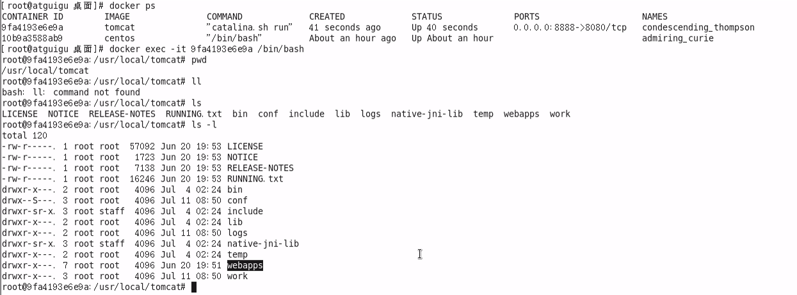 
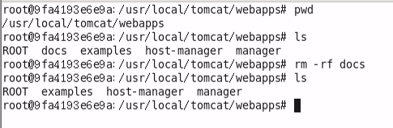 
#### 3.也即当前的tomcat运行实例是一个没有文档内容的容器，以它作为模板commit一个没有doc的tomcat新镜像yjh/tomcat02
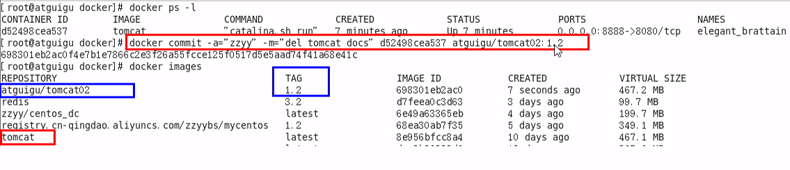 

#### 4.启动我们的新镜像并和原来的对比
1.启动yjh/tomcat02，它没有docs
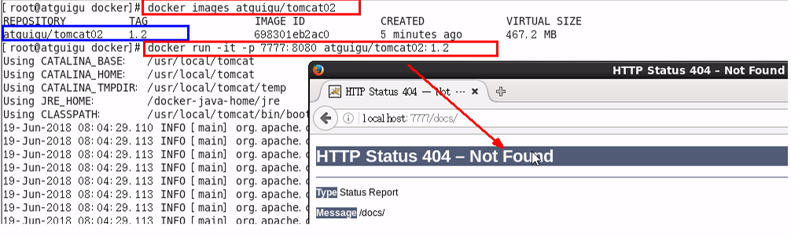

2.新启动原来的tomcat，有docs  

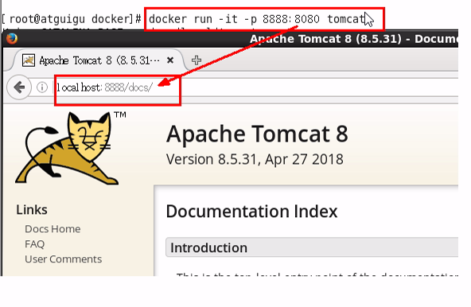

#### 补充
```
守护式（无打印信息）
后台方式启动：docker run -d -p 6666:8080 tomcat
```

### 5.8、Docker容器数据卷

#### 是什么？
一句话：有点类似Redis里面的rdb和aof文件
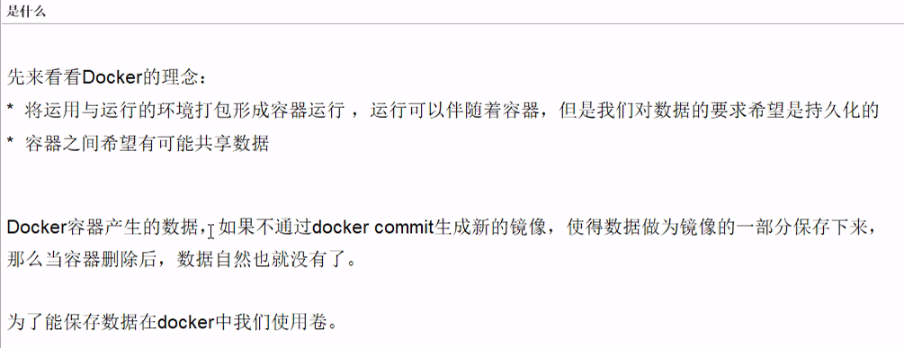
#### 能干吗？
1.容器的持久化  
2.容器间继承+共享数据  

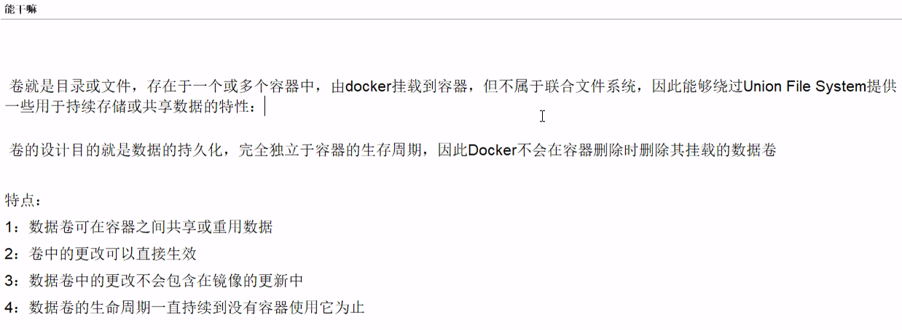
#### 数据卷
容器内添加方法：  
1.直接命令添加  

1.1:命令：docker run -it -v /宿主机绝对路径目录:/容器内目录 镜像名

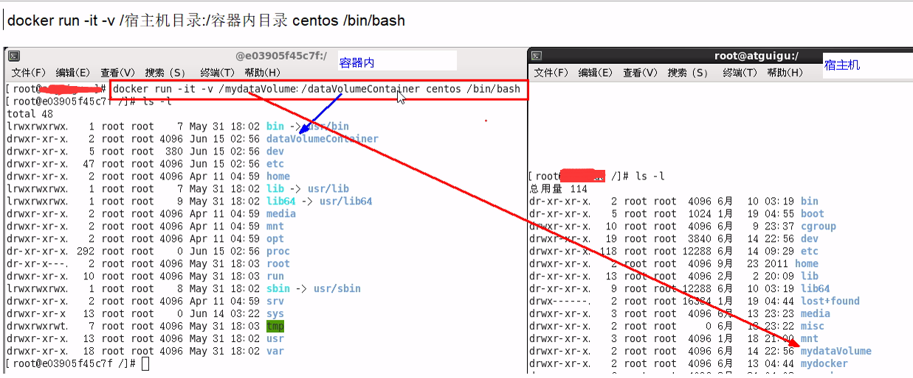

1.2:查看数据卷是否共享成功

docker inspect 容器ID //查看打印信息，Volumes

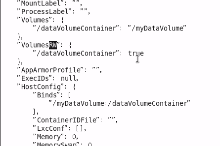

1.3：容器和宿主机之间数据共享
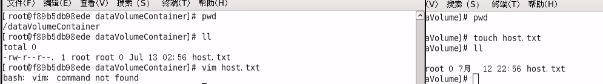
1.4：容器停止退出后，主机修改后数据是否同步  
     答：会同步，全量数据同步的拉去动作
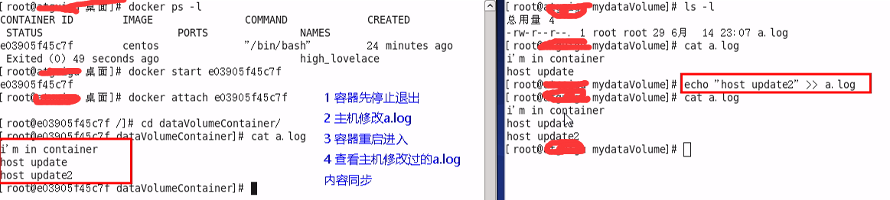

1.5：命令（带权限）
     docker run -it -v /宿主机绝对路径目录:/容器内目录:ro 镜像名   //ro:read only

2.DockerFile添加

2.1：根目录下新建mydocker文件夹并进入

2.2：可在Dockerfile中使用VOLUME指令来给镜像添加一个或多个数据卷

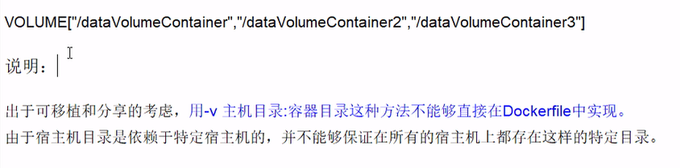

2.3：File构建

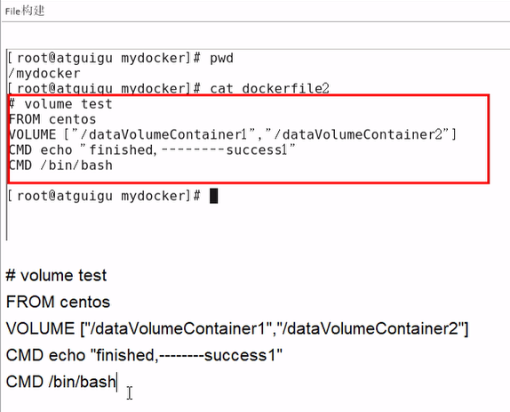

2.4：build后生成镜像           获得一个新镜像zzyy/centos

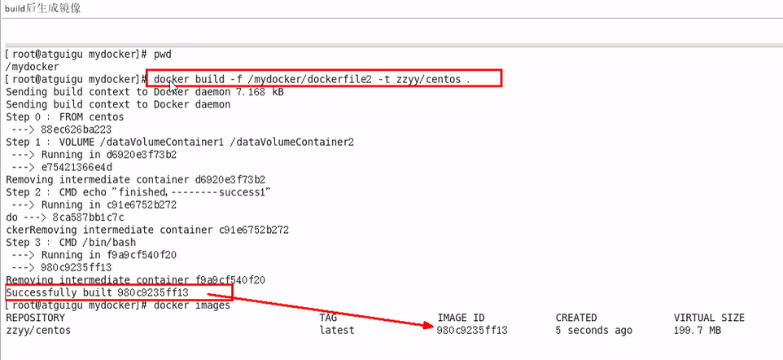

2.5:run容器

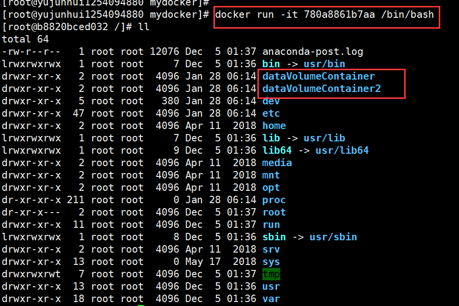

2.6：通过上述步骤，容器内的卷目录地址已经知道，对应的主机目录地址哪？

2.7：主机对应默认地址
    查看方式：docker inspect

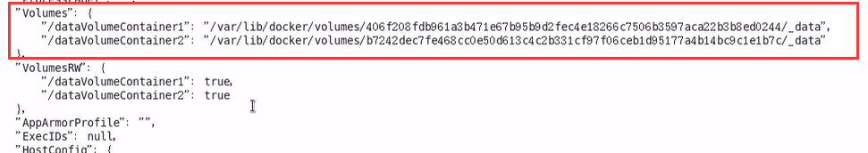

备注：

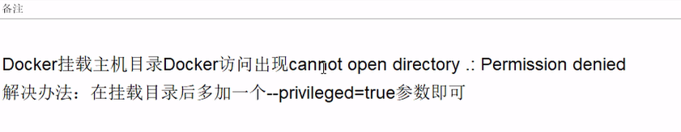

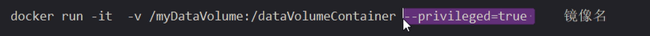

### 5.9、数据容器卷
1.是什么？    
    命名的容器挂载数据卷，其他容器通过挂载这个（父容器）实现数据共享，挂载数据卷的容器，称之为数据卷容器。
    通俗来讲就是“活动硬盘上挂活动硬盘，实现数据的传递依赖。”

2.总体介绍  
  2.1.以上一步新建的镜像zzyy/centos为模板并运行容器dc01/dc02/dc03    
  2.2.它们已经具有容器卷：/dataVolumeContainer1和/dataVolumeContainer2

3.容器间传递共享（--volumes-from）   
3.1：先启动一个父容器dc01，在dataVolumeContainer2新增内容


3.2：dc02/dc03继承dc01.
    
    ```
    --volumes-from
    命令：        dc02/dc03分别在dataVolumeContainer2各自新增内容
    ```
3.3：回到dc01可以看到02/03各自添加的都能共享了

3.4：删除dc01,dc02修改dc03可否访问
    答：可以，因为数据共享    
    
3.5：删除dc02后dc03可否访问
    3.4.1:再进一步：
    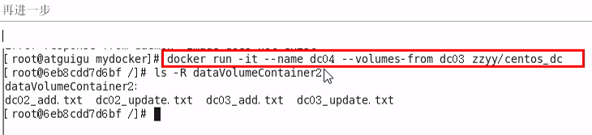

3.6：新建dc04继承dc03后再删除dc03
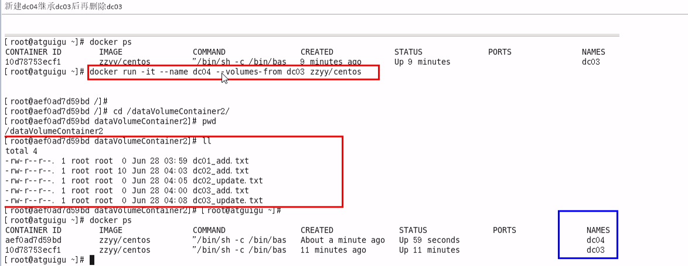

结论：容器之间配置信息的传递，数据卷的生命周期一直持续到没有容器使用它为止。